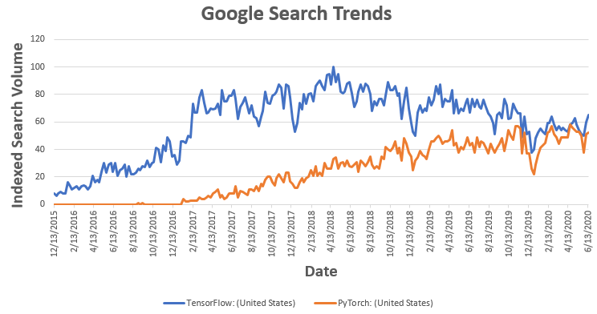

# PyTorch

PyTorch is a relatively new deep learning framework that is fast becoming popular among researchers. Like Chainer, PyTorch supports dynamic computation graphs, a feature that makes it attractive to researchers and engineers who work with text and time-series.

### PyTorch has now catch up with Tensorflow
---

